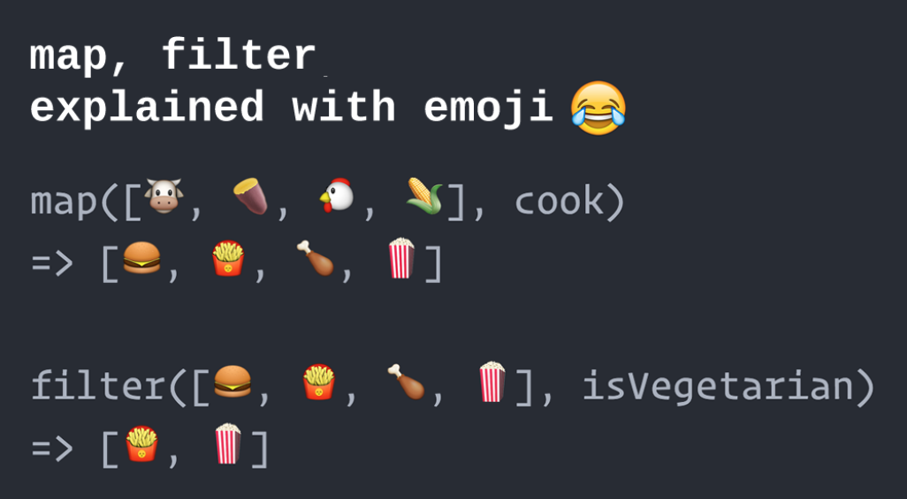

# Map and Filter



## Map

`.map()` will take an array, and produce a new array with new values. In an anonymous function, you define what each value in the array should be based on an existing item.

```js
const words = ['the', 'world', 'is', 'round', 'like', 'an', 'orange'];
const wordLengths = words.map(function(word) { return word.length });
// wordLengths = [ 3, 5, 2, 5, 4, 2, 6 ];
```

```js
const words = ['the', 'world', 'is', 'round', 'like', 'an', 'orange'];
const wordsWrappedInX = words.map(function(word) { 
  const newWord = 'x' + word + 'x';
  return newWord;
});
// wordLengths = [ 'xthex', 'xworldx', 'xisx', 'xroundx', 'xlikex', 'xanx', 'xorangex' ]
```

## Filter

`.filter()` will take an array, and produce a new array that only contains some of the items. Each item in the array runs through a function. If the function returns true, the item is included in the new array.

```js
const words = ['the', 'world', 'is', 'round', 'like', 'an', 'orange'];
const shortWords = words.filter(function(word) { return word.length <= 3 });
// shortWords = [ 'the', 'is', 'round', 'an' ];
```

```js
const words = ['the', 'world', 'is', 'round', 'like', 'an', 'orange'];
const wordsThatStartWithR = words.filter(function(word) { return word[0] === 'r' });
// wordsThatStartWithR = ['round'];
```

## Exercises

Work through each exercise in the `exercises` folder. 

As you edit code, run them with `node 1.js`.

## Try watch when working on your exercises

Try using the `watch` command, to keep a terminal process open that will automatically rerun your code!

Install it with brew:

```bash
brew install watch
```

This command re-runs an exercise every 0.3 seconds:

```bash
watch -n 0.3 node 1.js
```